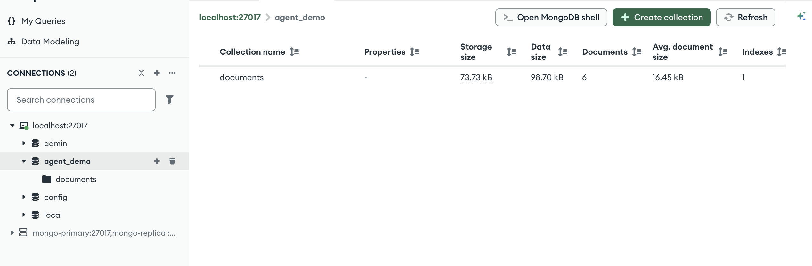
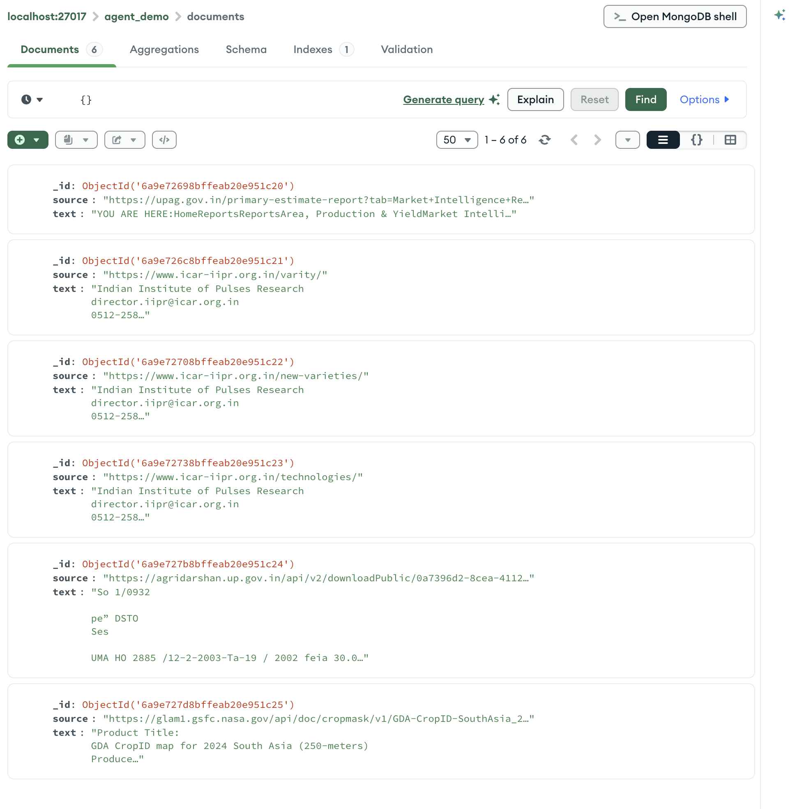
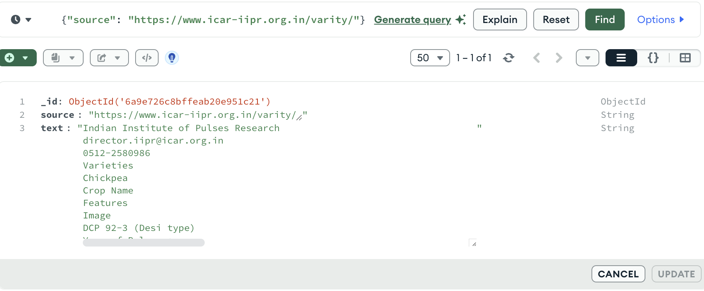

# Test Suite for Agriculture Sources

This folder tests every source from the original `sources.csv` in **no-LLM mode**.
That means each capability is called directly — no agent, no reasoning layer — so
we can verify that scraping, browser rendering, PDF extraction, and MongoDB
persistence all work on real agriculture URLs.

## What the test produces

Running `python test/test_sources.py` creates:

```text
test/
├── logs/
│   ├── upag_market_intelligence.log
│   ├── iipr_varieties.log
│   ├── iipr_new_varieties.log
│   ├── iipr_technologies.log
│   ├── up_agri_seed_rates.log
│   └── gda_rapeseed_2024.log
├── outputs/
│   ├── upag_market_intelligence.txt
│   ├── iipr_varieties.txt
│   ├── iipr_new_varieties.txt
│   ├── iipr_technologies.txt
│   ├── up_agri_seed_rates.txt
│   └── gda_rapeseed_2024.txt
├── summary.txt
└── README.md          # this file
```

| Artifact | Purpose |
|---|---|
| `logs/<source_id>.log` | Full terminal output for that source, including tool invocation, character count, file save path, and MongoDB insertion result. |
| `outputs/<source_id>.txt` | Final extracted text returned by the tool. |
| `summary.txt` | One-line status for every source after the run. |
| MongoDB `documents` collection | One document per source, stored as `{source: <url>, text: <extracted_text>}`. |

## How to run

### 1. Start MongoDB

If MongoDB is not running, the test will fail immediately with a clear message.

**macOS with Homebrew:**

```bash
brew tap mongodb/brew
brew install mongodb-community@7.0
brew services start mongodb-community@7.0
```

**Verify it is running:**

```bash
mongosh --eval "db.adminCommand('ping')"
```

### 2. Run the test runner

```bash
cd /Users/aniketsaxena/Documents/p/from_aug_1/p0/dailyPrep/7sep/AiAgentDemo
python test/test_sources.py
```

### 3. Inspect results

Check the summary:

```bash
cat test/summary.txt
```

Look at a specific log:

```bash
cat test/logs/iipr_varieties.log
```

Look at extracted text:

```bash
cat test/outputs/iipr_varieties.txt
```

Query MongoDB:

```bash
mongosh agent_demo --eval 'db.documents.find({source: "https://www.icar-iipr.org.in/varity/"}, {_id: 1, source: 1})'
```

## Source mapping

| Source ID | Modality | Tool used |
|---|---|---|
| `upag_market_intelligence` | `dynamic_web` | `scrape_dynamic` (Playwright) |
| `iipr_varieties` | `web` | `scrape_web` (smart static fallback) |
| `iipr_new_varieties` | `web` | `scrape_web` (smart static fallback) |
| `iipr_technologies` | `web` | `scrape_web` (smart static fallback) |
| `up_agri_seed_rates` | `pdf` | `extract_pdf` (pypdf → pymupdf → OCR) |
| `gda_rapeseed_2024` | `web_doc` | `scrape_web` (smart static fallback) |

## MongoDB Compass: what to screenshot

Open **MongoDB Compass** (or any MongoDB GUI). Use these steps to capture
exactly what the test saved.

### Screenshot 1 — Connection screen

1. Open MongoDB Compass.
2. Create or select the connection: `mongodb://localhost:27017`.
3. Click **Connect**.
4. 

### Screenshot 2 — Database + collection list

1. In the left sidebar, click on **`agent_demo`** database.
2. You should see the `documents` collection.
3. 

### Screenshot 3 — Documents list view

1. Click on the **`documents`** collection.
2. Make sure the **Documents** tab is selected (not Aggregations / Schema).
3.  Each row shows:
   - `_id`
   - `source` (the URL)
   - `text` (preview, truncated)


### Screenshot 4 — Filtered view for one source

1. In the filter bar at the top, type:
   ```json
   {"source": "https://www.icar-iipr.org.in/varity/"}
   ```
2. Press Enter or click **Find**.
   


## Expected final state

After a successful run:

- 6 `.log` files in `test/logs/`
- 6 `.txt` files in `test/outputs/`
- 6 documents in MongoDB `agent_demo.documents`
- `test/summary.txt` shows all sources as `success`

## Troubleshooting

### MongoDB connection refused

```text
ERROR: Cannot connect to MongoDB: localhost:27017: [Errno 61] Connection refused
```

Fix: start MongoDB.

```bash
brew services start mongodb-community@7.0
```

If you do not have it installed:

```bash
brew tap mongodb/brew
brew install mongodb-community@7.0
brew services start mongodb-community@7.0
```

### Playwright browser missing

```text
Playwright is required for dynamic-web scraping.
```

Fix:

```bash
playwright install chromium
```

### OCR garbled text on scanned PDF

The `up_agri_seed_rates` PDF is a scanned government document. If OCR returns
garbled characters, it usually means the local Tesseract language data does not
match the document language. The fallback chain still ran correctly; improving
OCR language packs is a separate step.
